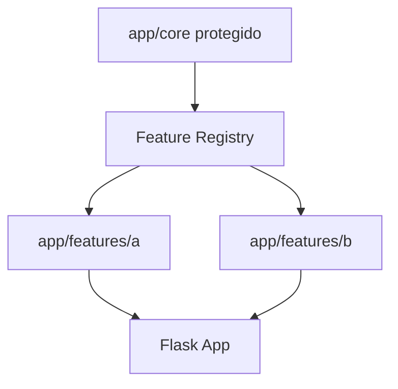

# Arquitetura

O core entrega rotas base, banco, templates principais e registry.

As features sao descobertas por `app/core/feature_registry.py`, que procura `app/features/*/manifest.py`.

Slots disponiveis:

- `PRODUCT_LIST_TOOLBAR`
- `PRODUCT_CARD`
- `CART_ITEM`
- `CART_SUMMARY`
- `CHECKOUT_FORM`
- `ORDER_SUMMARY`
- `MAIN_MENU`
- `DASHBOARD`
